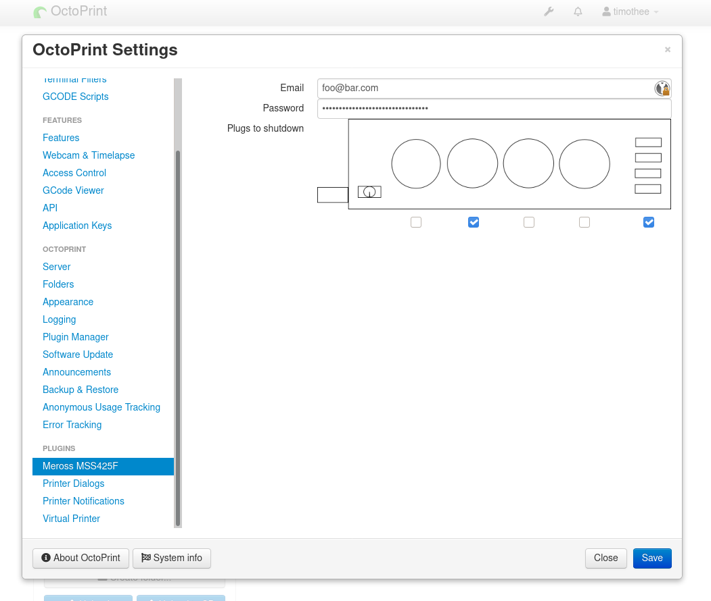

# OctoPrint-MerossMSS425F

A simple Octoprint plugin for shutdown device like printer with Meross MSS425F smart plug

## Setup

Install via the bundled [Plugin Manager](https://docs.octoprint.org/en/master/bundledplugins/pluginmanager.html)
or manually using this URL:

    https://github.com/timgir/OctoPrint-MerossMSS425F/archive/master.zip

## Configuration

Go to Octoprint settings & `Meross MSS425F` for add email & password at your Meross account &
choose plug to shutdown.

After that, add `M81` instruction into your GCODE file.

## Thank-you

I use [MerossIot python library](https://github.com/albertogeniola/MerossIot) at Alberto Geniola,
thanks to him.

Thank you to Gina Häußge & contributors for Octoprint, awesome tool !

Thank you to jneilliii & cp2004 for help me to write this plugin.

## Donation & sponsors

If you like my work, consider supporting people without whom it wouldn't exist :

- [Alberto Geniola](https://github.com/albertogeniola/MerossIot#donate)
- [Gina Häußge & Octoprint](https://octoprint.org/support-octoprint/)
- [jneilliii](https://github.com/jneilliii/OctoPrint-TPLinkSmartplug#support-my-efforts)
- [cp2004](https://github.com/cp2004)
- [Python Software Foundation](https://psfmember.org/civicrm/contribute/transact?reset=1&id=2)

If you want tip me :

    BTC: bc1qdmv385lnmrwl8l2y6xa2ruyly82ndzpht00e2w
    ETH: 0xe249812a56A7212539f28389585351F20945BCBB
